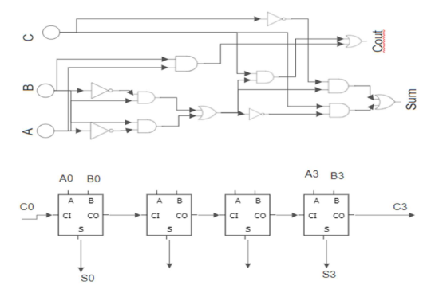
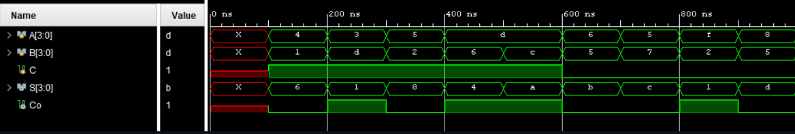

# Lab 2: Hexadecimal Full Adder :zap:
The purpose of this lab is to review and become familiar with the design and testing of 
combinational circuits using modular design (block symbols) in a computer-aided design tool. 
The circuit is to be designed and simulated in XilinxVivado environment. 

## Prelab
Using solely two-input AND gates and OR gates, implement a Hexadecimal Adder in a 
modular manner.

1. First, create a binary Full-adder module: 
        Write down the binary full adder truth table
        Demonstrate you know how to use K-Maps to derive the SOP Boolean equations for Sum and Cout
        Implement the obtained equations using ONLY 2-input AND and OR gates. Show the resulting circuit. 
        
2. Now, create the Hexadecimal adder
        Using a block diagram representation of your full adder (corresponding to step 1 above) show how to connect 
        enough instances of it to create a Hexadecimal adder (Circuit that is able to add one hexadecimal digit to another hexadecimal digit). 
        Show the resulting circuit

# In Lab Session
1. Implement your design in Xilinx
2. Simulate your design and demonstrate proper behavior of your simulated
waveforms to the TA
3. Remember to obtain screen images along the way to include in your report

*Requirements:*
- [ ] Schematics
- [ ] TestBench
- [ ] Simulation waveform
# Full-adder Module
```verilog
//FullAdder module of two bits 
module FullAdder(input A, input B, input C, output Sum, output Cout);
    //code
endmodule
```

# Hexadecimal Adder
```verilog
//Hexadecimal adder with two 4 bits inputs and 4 bits sum output 
module HexAdder(input [3:0]A, input[3:0]B, input C, output [3:0]Sum, output Cout);
    //code
endmodule  
```
# Images

* Circuit Schematic

        
    
* Hex Waveform
    
    

## Authors:
* [**Jesus Minjares**](https://github.com/jminjares4)
    * Master of Science in Computer Engineering <br>
[](mailto:jminjares4@miners.utep.edu) 
[](https://www.linkedin.com/in/jesusminjares/) [](https://github.com/jminjares4)
* [**Ismael Holguin**](https://github.com/iholguin6)
    * Master of Science in Computer Engineering <br>
[](mailto:iholguin6@miners.utep.edu) 
[](https://www.linkedin.com/in/ismael-holguin/) [](https://github.com/iholguin6)
    
