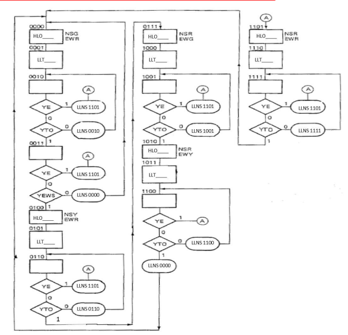
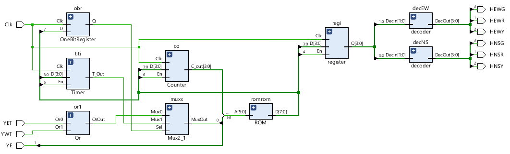
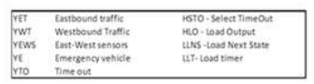

# Lab 5: Traffic Light Controller with Priority to Emergency Vehicles using MSI and LSI circuits  :zap:

## Objective: 
The purpose of this lab is to implement an ASM design of a Traffic Light Controller using 
Xilinx Vivado environment and verify operation in the simulator.

## Prelab (30%) Due AT BEGINNING OF LAB
**1.** **Complete the ASM chart** shown in Figure 1 by specifying the missing ***HLO output 
patterns, LLT timer values*** in the appropriate states (i.e. states where the controller must 
load the output and/or load the timer). **Make sure to include your calculations on how 
you obtained the timer values to receive credit for your answer. (Otherwise, no credit 
will be given)

**2.** Analyze this information and determine how to use each component to match 
the circuit diagram shown in Figure 2. Turn in the following: 
    
**a)** Draw one instance of **FD4CE** symbol and label each I/O with the corresponding 
connections to use this as the output register
    
**b)** Draw one instance of **CB4CLE** symbol and label each I/O with the corresponding 
connections to use this as the timer
    
**c)** Draw another instance of **CB4CLE** symbol and label each I/O with the 
corresponding connections to use this as the Next State Counter

**3.** Specify the contents of the full Programming table


## In lab session (50%) 

**a)** Implement the traffic light controller in a **schematic capture** by using your 
        ROM controller module (from Prelab) and **MSI/LSI** circuits like counters, 
        registers, MUXes and decoders as shown in the Circuit Diagram on Figure 2. 

**b)** Generate Verilog test fixture.

**c)** Perform waveform verification using ISim tool.The partially completed ASM Chart           (shown in Figure 1) belongs to a traffic light controller used in an intersection that normally allows only north-south traffic to go through. Only when east and westbound traffic sensors are activated will the traffic lights change to halt north-south traffic. In addition, an emergency input will set all traffic lights to red. When the emergency input is deactivated, the lights should return 
to the north-south green/ east-west red condition after a delay. The delay is given to 
allow a following emergency vehicle to activate the emergency input and keep the lights 
set to red. 

The corresponding signal definitions and circuit diagram of such a controller are shown 
in Figure 2. 

**Determine the timer values** that will cause the following behavior: 21 seconds for 
green lights and 9 seconds for yellow lights. The emergency vehicle signal will 
cause an all-red light condition that lasts 12 seconds. All timer values should be 
calculated based on a 1.5 second system clock cycle. Don’t forget that ***all*** 
states between output register changes (light transitions) must be included when 
calculating delays.

## Figure 1: ASM Chart – Partially completed (use for prelab part 1)


## Circuit Diagram



*Requirements:*

- [ ]  Schematic
- [ ]   Testbench
- [ ]   Simulation Waveform


# OR-Gate Module
```verilog
module Or(
    input Or0, Or1,
    output OrOut
    );
    
    //code

    endmodule 
```
# 2-to-1 Mux 
```verilog
    module Mux2_1(
    input A, B, Sel,
    output MuxOut 
    );
    // code
    endmodule
```
# One Bit Register 
```verilog
    module OneBitRegister(
    input D, Clk,
    output reg Q
    );
    // code
   endmodule 
```
# D Flip Flop
```verilog
    module DFlipFlop(
    input D, Clk, En,
    output reg Q/*, Qb*/
    );
    
    //code

    endmodule
```
# Register
```verilog
    module register(
    input [3:0]D,
    input En, //HLO
    input Clk,
    output [3:0]Q
    );
    DFlipFlop df0(.D(D[0]), .Clk(Clk), .Q(Q[0]), .En(En));
    // finish the code
    endmodule
```
# Timer 
```verilog
    module Timer(
    input [3:0]D,
    input Clk, En,
    output T_Out

    );
    always @ (posedge Clk)
    begin
        if()
        begin
            //code
        end
        if()
        else
        begin
            // code
        end
    end
    endmodule
```
# Counter 
```verilog
    module Counter(
    input [3:0]D,
    input Clk, En,
    output reg [3:0]C_out
    );
    //code
    endmodule
```
# Decoder
```verilog
    module decoder(
    input [1:0]DecIn,
    output reg [3:0]DecOut
    );
    //code
    always @ (DecIn)
    case(DecIn)
        2'b00 : DecOut <= 4'b0001;
     endcase
    endmodule
```
# ROM 
```verilog
    module ROM(input [5:0]A, output reg [7:0]D);
     always @ (A)
     case(A)
      //state 0 
      6'b0000_0_0 : D <= 9'b0_1_1_1_11_01;
     //state 1

     //etc
     
     //state15
     endcase
    endmodule
```
# ASM
```verilog
    module ASM(input YET, YWT,YE, Clk,
        output HEWR, HEWY, HEWG, HNSR, HNSY, HNSG
    );
    //code
    endmodule
```

# Constraint File
```
    set_property CLOCK_DEDICATED_ROUTE FALSE [get_nets Clk_IBUF]
    # inputs
    set_property PACKAGE_PIN V17 [get_ports YET]                 
        set_property IOSTANDARD LVCMOS33 [get_ports YET]
    #outputs    
    set_property PACKAGE_PIN U15 [get_ports {HEWR}]
        set_property IOSTANDARD LVCMOS33 [get_ports {HEWR}]   

```

# Software Development
| **Software** | **Environment** |
| :---:    | :---:       |
| ![Vivado](https://img.shields.io/static/v1?label=&message=Xilinx+Vivado&color=black&logo=data:image/png;base64,iVBORw0KGgoAAAANSUhEUgAAAEAAAABACAMAAACdt4HsAAABQVBMVEVeYABkZgB1dwB3eQCFhwCLjQmcniHS1CnV1zjX2Ufa3Fbl55Lo6qHq7Kzr7Vrr7bDt77%2Fu8Gn196v8%2FrT%2B%2F8P%2F%2F33%2F%2F9f%2F%2F%2F%2BLjQna3Fbl55Ll55La3Fbl55La3FaLjQna3Fbl55La3FaIigbl55Ll55KLjQmFhwCfoSba3FbZ21Ll55Ll55La3Fbl55LU1jTa3Fbl55L%2F%2F3ra3Fbl55La3Fba3Fbl55KLjQna3Fbl55La3Fbl55La3Fba3Fba3Fbl55KLjQn4%2Bq%2BLjQna3Fbl55Ll55Ll55KLjQna3Fbl55KLjQn196vb3Vzl55Ll55Ll55La3FZxcwB0dgDa3Fba3FaLjQna3Fba3FaLjQna3Fbl55KKjAeLjQnr7Wbl55La3Fba3FZ8fgCFhwCIigSLjQnX2Ufa3Fbl55Ln6Z3o6qFUKg%2FmAAAAYnRSTlMAAAAAAAAAAAAAAAAAAAAAAAAAAAAAAAAFCREVGBkgJSgoKS00NUFFRUVJSU1QUWFlZWVtcHl9fYGBgYWFiZObm5%2Bjr6%2BvtLe7u7u%2Fv8bLz9PX29vb3t%2Ff4%2Bfn5%2Bvr6%2B%2Fz99V9LS0AAAI%2BSURBVHjapdJlm9swDMDxZJ12TZxjZmZmvhszM7PnbN%2F%2FA8yt00dtJbdx%2FX9d%2FZ7IajDoWTAY1%2FYmdooCSi37Ae%2BU%2BuEFXCjdgQewq8rNtAxMKNMLRwBTlU49Ad1wS8A7hT1wA%2FAM2JYTgGfAvrsBeAbs0hGIFWnGF1BuwGtf4DYFJpyAcwrsOgFjFLhwAmIKvLfNRxroNrVyhqjYqYFCubAfnRc5gagzERoAU5XDnGGKA4qJqALQCXcosM5%2Bv2AA3ezPrwTYZ8YTwQML8lX%2FVj3wkR%2FngEdSvg27yf%2B5Zt6M88B9qYFCfxwP24FIL28DZKm3EJbOeWw5Q1RMrIDMAP0JpX4wZ8D1KTAkKwCERpghZ8BxCixIBMwSuks8Q%2BX2NuCGrAb0ElnfjYBfTwB8fgTMEqatDIhwnAGkrAVwCd2D8hnw8RlAUqDQEWXF0fAftYLrU2BIMkDQl5g627raujaftAsrsCAZ4MqAqJSIZPXf3%2FS6DTiSHBD04q9WU9PTeQ64JTkgwA84S6s6o8AXDsAFTtK67ozXAW8ZQC%2BA47TVpkAwwI5jDxsDZgFuHPu00QAoLfAwbdqJDXg5IO6luXo%2BxwG%2FP99M83aXA34tPc45fsavsHitR2yzA%2BSYLABXNSDE6LMc4xwAGaA7bDzOA4CAbuOT4z%2FxESBgYg66JoQNOAIKiNoH%2FTYihBVYAA7AB8VxHhgCAmCHZJwAAByA7U0LjAGAB2g8cB%2F8gEfgByyAD%2FBBToIXIAH8AM%2F%2BAwk%2BiPzFN%2BOgAAAAAElFTkSuQmCC%0A)| ![Verilog](https://img.shields.io/static/v1?label=&message=Verilog&color=blue&logo=data:image/png;base64,iVBORw0KGgoAAAANSUhEUgAAACAAAAAgCAMAAABEpIrGAAAABGdBTUEAALGPC%2FxhBQAAAAFzUkdCAK7OHOkAAAAgY0hSTQAAeiYAAICEAAD6AAAAgOgAAHUwAADqYAAAOpgAABdwnLpRPAAAAVZQTFRFAAAAAAAAAAAAAAAAAAAAAAAAAAAAAAAAAAAAAAAAAAAAAAAAAAAAAAAAAAAAAAAAAAAAAAAAAAAAAAAAAAAAAAAAAAAAAAAAAAAAAAAAAAAAAAAAAAAAAAAAAAAAAAAAAAAAAAAAAAAAAAAAAAAAAAAAAAAAAAAAAAAAAAAAAAAAAAAAAAAAAAAAAAAAAAAAAAAAAAAAAAAAAAAAAAAAAAAAAAAAAAAAAAAAAAAAAAAAAAAAAAAAAAAAAAAAAAAAAAAAAAAAAAAAAAAAAAAAAAAAAAAAAAAAAAAAAAAAAAAAAAAAAAAAAAAAAAAAAAAAAAAAAAAAAAAAAAAAAAAAAAAAAAAAAAAAAAAAAAAAAAAAAAAAAAAAAAAAAAAAAAAAAAAAAAAAAAAAAAAAAAAAAAAAAAAAAAAAAAAAAAAAAAAAAAAAAAAAAAAAAAAAAAAAAAAA%2F%2F%2F%2FyxSZEQAAAHB0Uk5TACDmwgk%2F%2B5dpllk088FTmnVzaPnPE7MFkpCcQuEewAe4Tt%2FFG2zlqAiD5%2BReJ3eMiGAMNX6NhFAEPn96K2H%2BgQJNvb6nZL8OR7DDxkXZ2AooItfa1tW7b9zd4N5qGkaHexyJbR1cSmu3ErKPm1JyWFVY6tcAAAABYktHRHGvB1ziAAAACXBIWXMAAA7EAAAOxAGVKw4bAAABf0lEQVQ4y92TWVOCUBiGKbG00lJLshCLFrVNrFxTs0NpUma2mEtGubQv5%2F9f9R2QxqkB7%2FsuzjMcHjjD8L4UBTM0bKIB5pFRcmXBFgIrHqO0GZ%2BwEcGOJ8nVFHaogvNHMLumZwBO7GYAs9hDNufUFykz72K9yrs5WnnUCqtvoU9Y5JeWASur%2FgAguBaENeBf39Dub26FhPA2tbMbicbiVCIZSSaoeCwa2kv1hHQGYzhjH2fIGVaAlaI5gHZGGvcErApYFbAmZA8QEg%2B9zFEOcZ68z8EhzuHLezgk2rPk%2FnGBkyTJJCIFCNkANoRMknQiFU7hc9xYZzLFM%2Bz2USVRTyiely9sJQPhcpCQubrGOSOBjPhfBLpiJFQgYjc8X61Wa3W2QcAqaLBsDcA3buFvMs07WRbuUw92QW61y51uS251O%2BV2SxYem4wSiDAkqm4QmMGRGxhaLfZPerGH4tT%2FFue5rzhQvReleq9q9d7I5nuf0Cvvh1bez9%2Fl1an%2FF8E34yTzLFjpmLMAAAAldEVYdGRhdGU6Y3JlYXRlADIwMjAtMDItMDdUMTc6MjQ6NDUrMDA6MDDiWEe%2BAAAAJXRFWHRkYXRlOm1vZGlmeQAyMDIwLTAyLTA3VDE3OjI0OjQ1KzAwOjAwkwX%2FAgAAAEZ0RVh0c29mdHdhcmUASW1hZ2VNYWdpY2sgNi43LjgtOSAyMDE5LTAyLTAxIFExNiBodHRwOi8vd3d3LmltYWdlbWFnaWNrLm9yZ0F74sgAAAAYdEVYdFRodW1iOjpEb2N1bWVudDo6UGFnZXMAMaf%2Fuy8AAAAYdEVYdFRodW1iOjpJbWFnZTo6aGVpZ2h0ADUxMsDQUFEAAAAXdEVYdFRodW1iOjpJbWFnZTo6V2lkdGgANTEyHHwD3AAAABl0RVh0VGh1bWI6Ok1pbWV0eXBlAGltYWdlL3BuZz%2ByVk4AAAAXdEVYdFRodW1iOjpNVGltZQAxNTgxMDk2Mjg13VzE4wAAABN0RVh0VGh1bWI6OlNpemUANy41M0tCQs3klRUAAABDdEVYdFRodW1iOjpVUkkAZmlsZTovLy4vdXBsb2Fkcy81Ni9zWnp0MUtzLzIxNDgvdmVyaWxvZ19pY29uXzEzMTg5NC5wbmc%2BkF9GAAAAAElFTkSuQmCC)|

## Authors:
* [**Jesus Minjares**](https://github.com/jminjares4)
    * Master of Science in Computer Engineering <br>
[](mailto:jminjares4@miners.utep.edu) 
[]https://www.linkedin.com/in/jesusminjares/) [](https://github.com/jminjares4)
* [**Ismael Holguin**](https://github.com/iholguin6)
    * Master of Science in Computer Engineering <br>
[](mailto:iholguin6@miners.utep.edu) 
[](https://www.linkedin.com/in/ismael-holguin/) [](https://github.com/iholguin6)
