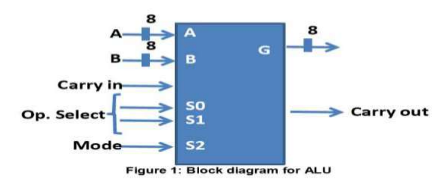
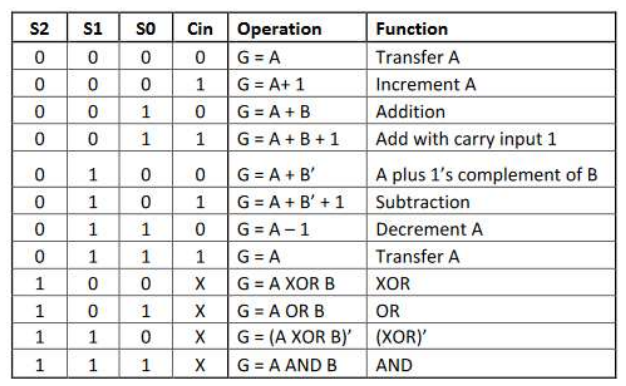
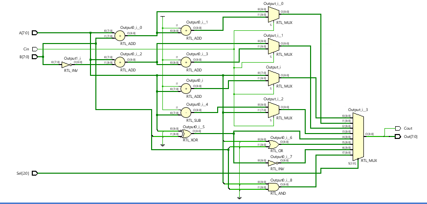

# Lab 7: Familiarization with ALU
## Objective
To become familiar with the arithmetic Logic Unit(ALU) and the concepts relating to implementation of ALUs

## Description
Design and implement an 8-bit Arithmetic Logic Unit(ALU). An ALU is a combinational circuit that performs arithmetic and logic micro-operations on a pair of n-bit operands(in our case, A[7:0] and B[7:0]). The operations performed by an ALU are controlled by a set of operation-selected inputs. 

Your 8-bit ALU will have 4 operation-select inputs: S2,S1,S0, and Cin. S2 will be used as the MUX select to choose the mode of operation(S2=0 chooses arithmetic unit, S2=1 chooses logic unit). The block diagram is shown in Figure 1 below.

## Figure 1


## ALU Functions - Table 1


## PreLab(30%) DUE AT BEGINNING OF LAB
Design an 8-bit ALU that performs the operations listed in Table 1

**1)** Draw the block diagram for the Arithmetic Unit. Additionally show logic diagram for each of the two blocks on Arithmetic Unit(make sure to show the optimized implementation of the "transformation" block) 

**2)** Draw one stage of the Logic Unit circuit

**3)** Draw a single stage of the ALU

## In Lab Session(50%)
Using Xilinx, implement the design developed on the pre-lab activities 

* You will slighly modify the circuit developed for Lab 6 in order to use it as the logic Module.
* You can use a standard 8-bit adder module from Xilinx library as part of Arithmetic Unit
* The Xilinx environment will allow to create a modular design and simulate its operation in order to verify functionality
* demonstrate your design (simulation to verify *all* 12 ALU operations) before the end of the lab session.


## ALU Module
```verilog
module ALU(
    input [7:0] A,
    input [7:0] B,
    input [2:0] Sel,
    input Cin,
    output [7:0] Out,
    output Cout
    );
    
    always @ (Sel, Cin)
    begin
    case(Sel)
    3'b000 : case(Cin)
        
        endcase
        end
endmodule
```
## Constraint 
```verilog
    set_property CLOCK_DEDICATED_ROUTE FALSE [get_nets Clk_IBUF]
    #input
    set_property PACKAGE_PIN V17 [get_ports A[0]]                
    set_property IOSTANDARD LVCMOS33 [get_ports A[0]]
    #output
    set_property PACKAGE_PIN U16 [get_ports {Out[0]}]
    set_property IOSTANDARD LVCMOS33 [get_ports {Out[0]}]
```


## Lab 7 Output Schematic



# Software Development
| **Software** | **Environment** |
| :---:    | :---:       |
| ![Vivado](https://img.shields.io/static/v1?label=&message=Xilinx+Vivado&color=black&logo=data:image/png;base64,iVBORw0KGgoAAAANSUhEUgAAAEAAAABACAMAAACdt4HsAAABQVBMVEVeYABkZgB1dwB3eQCFhwCLjQmcniHS1CnV1zjX2Ufa3Fbl55Lo6qHq7Kzr7Vrr7bDt77%2Fu8Gn196v8%2FrT%2B%2F8P%2F%2F33%2F%2F9f%2F%2F%2F%2BLjQna3Fbl55Ll55La3Fbl55La3FaLjQna3Fbl55La3FaIigbl55Ll55KLjQmFhwCfoSba3FbZ21Ll55Ll55La3Fbl55LU1jTa3Fbl55L%2F%2F3ra3Fbl55La3Fba3Fbl55KLjQna3Fbl55La3Fbl55La3Fba3Fba3Fbl55KLjQn4%2Bq%2BLjQna3Fbl55Ll55Ll55KLjQna3Fbl55KLjQn196vb3Vzl55Ll55Ll55La3FZxcwB0dgDa3Fba3FaLjQna3Fba3FaLjQna3Fbl55KKjAeLjQnr7Wbl55La3Fba3FZ8fgCFhwCIigSLjQnX2Ufa3Fbl55Ln6Z3o6qFUKg%2FmAAAAYnRSTlMAAAAAAAAAAAAAAAAAAAAAAAAAAAAAAAAFCREVGBkgJSgoKS00NUFFRUVJSU1QUWFlZWVtcHl9fYGBgYWFiZObm5%2Bjr6%2BvtLe7u7u%2Fv8bLz9PX29vb3t%2Ff4%2Bfn5%2Bvr6%2B%2Fz99V9LS0AAAI%2BSURBVHjapdJlm9swDMDxZJ12TZxjZmZmvhszM7PnbN%2F%2FA8yt00dtJbdx%2FX9d%2FZ7IajDoWTAY1%2FYmdooCSi37Ae%2BU%2BuEFXCjdgQewq8rNtAxMKNMLRwBTlU49Ad1wS8A7hT1wA%2FAM2JYTgGfAvrsBeAbs0hGIFWnGF1BuwGtf4DYFJpyAcwrsOgFjFLhwAmIKvLfNRxroNrVyhqjYqYFCubAfnRc5gagzERoAU5XDnGGKA4qJqALQCXcosM5%2Bv2AA3ezPrwTYZ8YTwQML8lX%2FVj3wkR%2FngEdSvg27yf%2B5Zt6M88B9qYFCfxwP24FIL28DZKm3EJbOeWw5Q1RMrIDMAP0JpX4wZ8D1KTAkKwCERpghZ8BxCixIBMwSuks8Q%2BX2NuCGrAb0ElnfjYBfTwB8fgTMEqatDIhwnAGkrAVwCd2D8hnw8RlAUqDQEWXF0fAftYLrU2BIMkDQl5g627raujaftAsrsCAZ4MqAqJSIZPXf3%2FS6DTiSHBD04q9WU9PTeQ64JTkgwA84S6s6o8AXDsAFTtK67ozXAW8ZQC%2BA47TVpkAwwI5jDxsDZgFuHPu00QAoLfAwbdqJDXg5IO6luXo%2BxwG%2FP99M83aXA34tPc45fsavsHitR2yzA%2BSYLABXNSDE6LMc4xwAGaA7bDzOA4CAbuOT4z%2FxESBgYg66JoQNOAIKiNoH%2FTYihBVYAA7AB8VxHhgCAmCHZJwAAByA7U0LjAGAB2g8cB%2F8gEfgByyAD%2FBBToIXIAH8AM%2F%2BAwk%2BiPzFN%2BOgAAAAAElFTkSuQmCC%0A)| ![Verilog](https://img.shields.io/static/v1?label=&message=Verilog&color=blue&logo=data:image/png;base64,iVBORw0KGgoAAAANSUhEUgAAACAAAAAgCAMAAABEpIrGAAAABGdBTUEAALGPC%2FxhBQAAAAFzUkdCAK7OHOkAAAAgY0hSTQAAeiYAAICEAAD6AAAAgOgAAHUwAADqYAAAOpgAABdwnLpRPAAAAVZQTFRFAAAAAAAAAAAAAAAAAAAAAAAAAAAAAAAAAAAAAAAAAAAAAAAAAAAAAAAAAAAAAAAAAAAAAAAAAAAAAAAAAAAAAAAAAAAAAAAAAAAAAAAAAAAAAAAAAAAAAAAAAAAAAAAAAAAAAAAAAAAAAAAAAAAAAAAAAAAAAAAAAAAAAAAAAAAAAAAAAAAAAAAAAAAAAAAAAAAAAAAAAAAAAAAAAAAAAAAAAAAAAAAAAAAAAAAAAAAAAAAAAAAAAAAAAAAAAAAAAAAAAAAAAAAAAAAAAAAAAAAAAAAAAAAAAAAAAAAAAAAAAAAAAAAAAAAAAAAAAAAAAAAAAAAAAAAAAAAAAAAAAAAAAAAAAAAAAAAAAAAAAAAAAAAAAAAAAAAAAAAAAAAAAAAAAAAAAAAAAAAAAAAAAAAAAAAAAAAAAAAAAAAAAAAAAAAAAAAAAAAAAAAAAAAAAAAA%2F%2F%2F%2FyxSZEQAAAHB0Uk5TACDmwgk%2F%2B5dpllk088FTmnVzaPnPE7MFkpCcQuEewAe4Tt%2FFG2zlqAiD5%2BReJ3eMiGAMNX6NhFAEPn96K2H%2BgQJNvb6nZL8OR7DDxkXZ2AooItfa1tW7b9zd4N5qGkaHexyJbR1cSmu3ErKPm1JyWFVY6tcAAAABYktHRHGvB1ziAAAACXBIWXMAAA7EAAAOxAGVKw4bAAABf0lEQVQ4y92TWVOCUBiGKbG00lJLshCLFrVNrFxTs0NpUma2mEtGubQv5%2F9f9R2QxqkB7%2FsuzjMcHjjD8L4UBTM0bKIB5pFRcmXBFgIrHqO0GZ%2BwEcGOJ8nVFHaogvNHMLumZwBO7GYAs9hDNufUFykz72K9yrs5WnnUCqtvoU9Y5JeWASur%2FgAguBaENeBf39Dub26FhPA2tbMbicbiVCIZSSaoeCwa2kv1hHQGYzhjH2fIGVaAlaI5gHZGGvcErApYFbAmZA8QEg%2B9zFEOcZ68z8EhzuHLezgk2rPk%2FnGBkyTJJCIFCNkANoRMknQiFU7hc9xYZzLFM%2Bz2USVRTyiely9sJQPhcpCQubrGOSOBjPhfBLpiJFQgYjc8X61Wa3W2QcAqaLBsDcA3buFvMs07WRbuUw92QW61y51uS251O%2BV2SxYem4wSiDAkqm4QmMGRGxhaLfZPerGH4tT%2FFue5rzhQvReleq9q9d7I5nuf0Cvvh1bez9%2Fl1an%2FF8E34yTzLFjpmLMAAAAldEVYdGRhdGU6Y3JlYXRlADIwMjAtMDItMDdUMTc6MjQ6NDUrMDA6MDDiWEe%2BAAAAJXRFWHRkYXRlOm1vZGlmeQAyMDIwLTAyLTA3VDE3OjI0OjQ1KzAwOjAwkwX%2FAgAAAEZ0RVh0c29mdHdhcmUASW1hZ2VNYWdpY2sgNi43LjgtOSAyMDE5LTAyLTAxIFExNiBodHRwOi8vd3d3LmltYWdlbWFnaWNrLm9yZ0F74sgAAAAYdEVYdFRodW1iOjpEb2N1bWVudDo6UGFnZXMAMaf%2Fuy8AAAAYdEVYdFRodW1iOjpJbWFnZTo6aGVpZ2h0ADUxMsDQUFEAAAAXdEVYdFRodW1iOjpJbWFnZTo6V2lkdGgANTEyHHwD3AAAABl0RVh0VGh1bWI6Ok1pbWV0eXBlAGltYWdlL3BuZz%2ByVk4AAAAXdEVYdFRodW1iOjpNVGltZQAxNTgxMDk2Mjg13VzE4wAAABN0RVh0VGh1bWI6OlNpemUANy41M0tCQs3klRUAAABDdEVYdFRodW1iOjpVUkkAZmlsZTovLy4vdXBsb2Fkcy81Ni9zWnp0MUtzLzIxNDgvdmVyaWxvZ19pY29uXzEzMTg5NC5wbmc%2BkF9GAAAAAElFTkSuQmCC)|

## Authors:
* [**Jesus Minjares**](https://github.com/jminjares4)
    * Master of Science in Computer Engineering <br>
[](mailto:jminjares4@miners.utep.edu) 
[](https://www.linkedin.com/in/jesus-minjares-157a21195/) [](https://github.com/jminjares4)
* [**Ismael Holguin**](https://github.com/iholguin6)
    * Master of Science in Computer Engineering <br>
[](mailto:iholguin6@miners.utep.edu) 
[](https://www.linkedin.com/in/ismael-holguin-5ab421224/) [](https://github.com/iholguin6)
