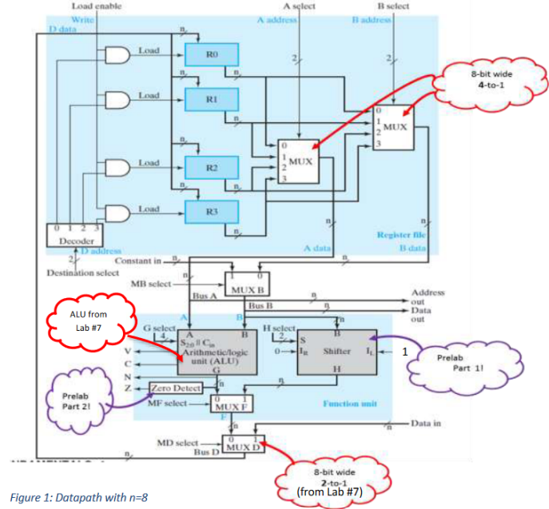
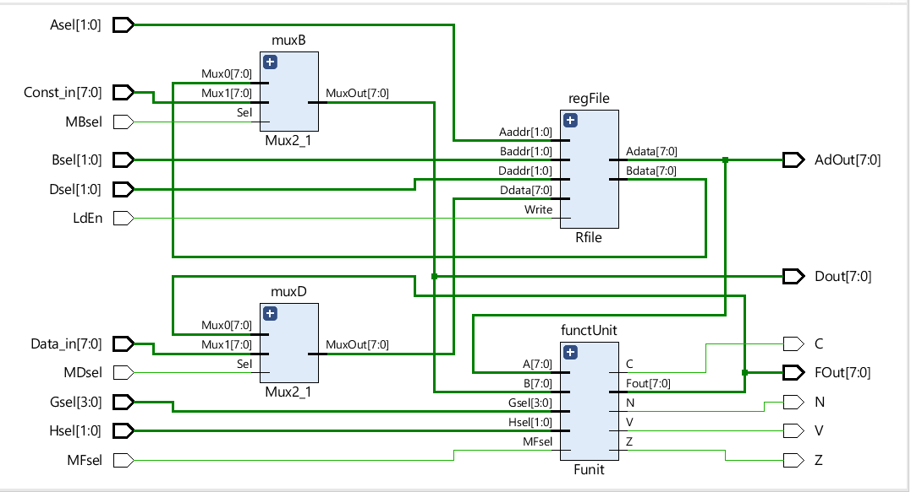

#  Lab 8: Familiarization with Datapaths :zap:

## Objective:
To combine a set of registers with a function unit ( containing ALU
and Shifter) and interconnecting paths to create a Datapath

## Figure 1 Datapath 


## Lab Description:
In this laboratory your assignment consists of building a simple bus-based
datapath with: four registers (R0, R1, R2, and R3), an ALU (from Lab #7), and a
shifter. A datapath uses registers, buses, multiplexers, decoders and processing
circuits. The registers in a datapath interact by the direct transfer of data,
as well as in the performance of the various types of microoperations. The
datapath that you will construct is shown in the block diagram shown in Figure
1 above (where n = 8).

On Figure 1, become familiar with the three sets of select inputs shown: the
G select, H select, and MF select. To fully specify the function unit symbol,
all of the codes for MF select, G select, and H select must be defined in
terms of the codes for FS. These code transformations are defined in Table 1
and will be used during Lab Implementation.

## PreLab(30%)
Design an 8-bit shifter that performs the following transformations on
operand “B”. (Chosen transformation is related to H select bits shown
on Table 1 above):

S1S0=00 → Pass B,

S1S0=01 →Shift left (IL =1)

S1S0=10 → Shift right (IR=0)

S1S0=11 →All zeroes.

The function unit provides 4 status flags: N-sign, Z-Zero, V-Overflow, C-Carry. Draw by hand the logic diagram that shows how each of these
status signals (flags) are generated. Additionally, answer which status
signals are generated by the logic unit

## Lab (50%) 
Using Xilinx, implement the Datapath design shown in the provided block
diagram (Figure 1). You will use the modules developed in Lab 7, as well as
those
d eveloped on the prelab activities and those created during the lab session to
create this Datapath.
The Xilinx environment will allow you to simulate the datapath operation in order
to verify correct operation. Your datapath should be able to implement the desired microoperation selected by the FS code as described on Table 1:
## Table 1
| **FS**    | **Select (MF)** | **Select (G)** | **Select (H)** | **Micro-operation** |
| :---      | :---            | :---           | :----          | :----               |
| 0 00 00   | 0               | 0000           | **00**         | G = A               |
| 0 00 01   | 0               | 0001           | **00**         | G = A + 1           |
| 0 00 10   | 0               | 0010           | **00**         | G = A + B           |
| 0 00 11   | 0               | 0011           | **00**         | G = A + B + 1       |
| 0 01 00   | 0               | 0100           | **01**         | G = A + B'          |
| 0 01 01   | 0               | 0101           | **01**         | G = A + B' + 1      |
| 0 01 10   | 0               | 0110           | **01**         | G = A - 1           |
| 0 01 11   | 0               | 0111           | **01**         | G = A               |
| 0 10 00   | 0               | 1000           | **10**         | G = A XOR B         |
| 0 10 10   | 0               | 1010           | **10**         | G = A OR B          |
| 0 11 00   | 0               | 1100           | **11**         | G = (A XOR B)'      |
| 0 11 10   | 0               | 1110           | **11**         | G = (A AND B)       |
| 1 00 00   | 1               | **0000**       | 00             | G = B               |
| 1 01 00   | 1               | **0100**       | 01             | G = sl B            |
| 1 10 00   | 1               | **1000**       | 11             | G = sr B            |
| 1 11 00   | 1               | **1000**       | 11             | G = 0's             |

## Decoder - 2Bit
```verilog
module DEC(
    input [1:0]Dsel,
    output reg [3:0]Data
    );
    // code 

endmodule
```
## Register
```verilog
module Register(
    input [7:0]D,
    input Load,
    output reg [7:0]Q
    );
  //code 
endmodule
```
## Mux 2-to-1
```verilog
module Mux2_1(
  input [7:0] Mux0, Mux1,
  input Sel,
  output [7:0] MuxOut
    );
    //code
endmodule
```

## Mux 4-to-1
```verilog
module Mux4_1(
  input [7:0] Mux0, Mux1, Mux2, Mux3,
  input [1:0] Sel,
  output [7:0] MuxOut
);

//code
endmodule
```
## ALU Module
```verilog
module ALU(
    input [7:0]A, B,
    input [3:0]Gsel,
    output reg [7:0]Out,
  output reg C, V
    );
 
 
    always @(Gsel)
    begin
      case(G)
        //code 
      endcase
    end
    
endmodule
```

## Shifter
```verilog
    module SHIFTER(
        input [7:0]B,
        input [1:0]Hsel,
        output reg [7:0]H
    );

        always @(Hsel)
        begin
            case(Hsel)
            //code        
        endcase
        end

    endmodule
```

## Function unit
```verilog
module Funit(
    input [7:0]A, B,
    input [3:0]Gsel,
    input [1:0]Hsel,
    input MFsel,
  output [7:0]Fout,
    output V, C, N, Z
    );
   
   //code
endmodule
```
## Rfile
```verilog
module Rfile(
    input [7:0]Ddata,
    input [1:0]Aaddr, Baddr, Daddr,
    input Write,
    output [7:0]Adata, Bdata
    );
 .MuxOut(Bdata));
endmodule
```
## Datapath
```verilog
module Datapath(
    input [1:0]Asel, Bsel, Dsel, Hsel,
    input [3:0]Gsel,
    input LdEn, MDsel, MBsel, MFsel,
    input [7:0]Data_in, Const_in,
  output [7:0]AdOut, Dout, FOut,
    output V, C, N, Z
    );
   
  //code
endmodule
```
## Lab 8 utput Schematic


# Software Development
| **Software** | **Environment** |
| :---:    | :---:       |
| ![Vivado](https://img.shields.io/static/v1?label=&message=Xilinx+Vivado&color=black&logo=data:image/png;base64,iVBORw0KGgoAAAANSUhEUgAAAEAAAABACAMAAACdt4HsAAABQVBMVEVeYABkZgB1dwB3eQCFhwCLjQmcniHS1CnV1zjX2Ufa3Fbl55Lo6qHq7Kzr7Vrr7bDt77%2Fu8Gn196v8%2FrT%2B%2F8P%2F%2F33%2F%2F9f%2F%2F%2F%2BLjQna3Fbl55Ll55La3Fbl55La3FaLjQna3Fbl55La3FaIigbl55Ll55KLjQmFhwCfoSba3FbZ21Ll55Ll55La3Fbl55LU1jTa3Fbl55L%2F%2F3ra3Fbl55La3Fba3Fbl55KLjQna3Fbl55La3Fbl55La3Fba3Fba3Fbl55KLjQn4%2Bq%2BLjQna3Fbl55Ll55Ll55KLjQna3Fbl55KLjQn196vb3Vzl55Ll55Ll55La3FZxcwB0dgDa3Fba3FaLjQna3Fba3FaLjQna3Fbl55KKjAeLjQnr7Wbl55La3Fba3FZ8fgCFhwCIigSLjQnX2Ufa3Fbl55Ln6Z3o6qFUKg%2FmAAAAYnRSTlMAAAAAAAAAAAAAAAAAAAAAAAAAAAAAAAAFCREVGBkgJSgoKS00NUFFRUVJSU1QUWFlZWVtcHl9fYGBgYWFiZObm5%2Bjr6%2BvtLe7u7u%2Fv8bLz9PX29vb3t%2Ff4%2Bfn5%2Bvr6%2B%2Fz99V9LS0AAAI%2BSURBVHjapdJlm9swDMDxZJ12TZxjZmZmvhszM7PnbN%2F%2FA8yt00dtJbdx%2FX9d%2FZ7IajDoWTAY1%2FYmdooCSi37Ae%2BU%2BuEFXCjdgQewq8rNtAxMKNMLRwBTlU49Ad1wS8A7hT1wA%2FAM2JYTgGfAvrsBeAbs0hGIFWnGF1BuwGtf4DYFJpyAcwrsOgFjFLhwAmIKvLfNRxroNrVyhqjYqYFCubAfnRc5gagzERoAU5XDnGGKA4qJqALQCXcosM5%2Bv2AA3ezPrwTYZ8YTwQML8lX%2FVj3wkR%2FngEdSvg27yf%2B5Zt6M88B9qYFCfxwP24FIL28DZKm3EJbOeWw5Q1RMrIDMAP0JpX4wZ8D1KTAkKwCERpghZ8BxCixIBMwSuks8Q%2BX2NuCGrAb0ElnfjYBfTwB8fgTMEqatDIhwnAGkrAVwCd2D8hnw8RlAUqDQEWXF0fAftYLrU2BIMkDQl5g627raujaftAsrsCAZ4MqAqJSIZPXf3%2FS6DTiSHBD04q9WU9PTeQ64JTkgwA84S6s6o8AXDsAFTtK67ozXAW8ZQC%2BA47TVpkAwwI5jDxsDZgFuHPu00QAoLfAwbdqJDXg5IO6luXo%2BxwG%2FP99M83aXA34tPc45fsavsHitR2yzA%2BSYLABXNSDE6LMc4xwAGaA7bDzOA4CAbuOT4z%2FxESBgYg66JoQNOAIKiNoH%2FTYihBVYAA7AB8VxHhgCAmCHZJwAAByA7U0LjAGAB2g8cB%2F8gEfgByyAD%2FBBToIXIAH8AM%2F%2BAwk%2BiPzFN%2BOgAAAAAElFTkSuQmCC%0A)| ![Verilog](https://img.shields.io/static/v1?label=&message=Verilog&color=blue&logo=data:image/png;base64,iVBORw0KGgoAAAANSUhEUgAAACAAAAAgCAMAAABEpIrGAAAABGdBTUEAALGPC%2FxhBQAAAAFzUkdCAK7OHOkAAAAgY0hSTQAAeiYAAICEAAD6AAAAgOgAAHUwAADqYAAAOpgAABdwnLpRPAAAAVZQTFRFAAAAAAAAAAAAAAAAAAAAAAAAAAAAAAAAAAAAAAAAAAAAAAAAAAAAAAAAAAAAAAAAAAAAAAAAAAAAAAAAAAAAAAAAAAAAAAAAAAAAAAAAAAAAAAAAAAAAAAAAAAAAAAAAAAAAAAAAAAAAAAAAAAAAAAAAAAAAAAAAAAAAAAAAAAAAAAAAAAAAAAAAAAAAAAAAAAAAAAAAAAAAAAAAAAAAAAAAAAAAAAAAAAAAAAAAAAAAAAAAAAAAAAAAAAAAAAAAAAAAAAAAAAAAAAAAAAAAAAAAAAAAAAAAAAAAAAAAAAAAAAAAAAAAAAAAAAAAAAAAAAAAAAAAAAAAAAAAAAAAAAAAAAAAAAAAAAAAAAAAAAAAAAAAAAAAAAAAAAAAAAAAAAAAAAAAAAAAAAAAAAAAAAAAAAAAAAAAAAAAAAAAAAAAAAAAAAAAAAAAAAAAAAAAAAAA%2F%2F%2F%2FyxSZEQAAAHB0Uk5TACDmwgk%2F%2B5dpllk088FTmnVzaPnPE7MFkpCcQuEewAe4Tt%2FFG2zlqAiD5%2BReJ3eMiGAMNX6NhFAEPn96K2H%2BgQJNvb6nZL8OR7DDxkXZ2AooItfa1tW7b9zd4N5qGkaHexyJbR1cSmu3ErKPm1JyWFVY6tcAAAABYktHRHGvB1ziAAAACXBIWXMAAA7EAAAOxAGVKw4bAAABf0lEQVQ4y92TWVOCUBiGKbG00lJLshCLFrVNrFxTs0NpUma2mEtGubQv5%2F9f9R2QxqkB7%2FsuzjMcHjjD8L4UBTM0bKIB5pFRcmXBFgIrHqO0GZ%2BwEcGOJ8nVFHaogvNHMLumZwBO7GYAs9hDNufUFykz72K9yrs5WnnUCqtvoU9Y5JeWASur%2FgAguBaENeBf39Dub26FhPA2tbMbicbiVCIZSSaoeCwa2kv1hHQGYzhjH2fIGVaAlaI5gHZGGvcErApYFbAmZA8QEg%2B9zFEOcZ68z8EhzuHLezgk2rPk%2FnGBkyTJJCIFCNkANoRMknQiFU7hc9xYZzLFM%2Bz2USVRTyiely9sJQPhcpCQubrGOSOBjPhfBLpiJFQgYjc8X61Wa3W2QcAqaLBsDcA3buFvMs07WRbuUw92QW61y51uS251O%2BV2SxYem4wSiDAkqm4QmMGRGxhaLfZPerGH4tT%2FFue5rzhQvReleq9q9d7I5nuf0Cvvh1bez9%2Fl1an%2FF8E34yTzLFjpmLMAAAAldEVYdGRhdGU6Y3JlYXRlADIwMjAtMDItMDdUMTc6MjQ6NDUrMDA6MDDiWEe%2BAAAAJXRFWHRkYXRlOm1vZGlmeQAyMDIwLTAyLTA3VDE3OjI0OjQ1KzAwOjAwkwX%2FAgAAAEZ0RVh0c29mdHdhcmUASW1hZ2VNYWdpY2sgNi43LjgtOSAyMDE5LTAyLTAxIFExNiBodHRwOi8vd3d3LmltYWdlbWFnaWNrLm9yZ0F74sgAAAAYdEVYdFRodW1iOjpEb2N1bWVudDo6UGFnZXMAMaf%2Fuy8AAAAYdEVYdFRodW1iOjpJbWFnZTo6aGVpZ2h0ADUxMsDQUFEAAAAXdEVYdFRodW1iOjpJbWFnZTo6V2lkdGgANTEyHHwD3AAAABl0RVh0VGh1bWI6Ok1pbWV0eXBlAGltYWdlL3BuZz%2ByVk4AAAAXdEVYdFRodW1iOjpNVGltZQAxNTgxMDk2Mjg13VzE4wAAABN0RVh0VGh1bWI6OlNpemUANy41M0tCQs3klRUAAABDdEVYdFRodW1iOjpVUkkAZmlsZTovLy4vdXBsb2Fkcy81Ni9zWnp0MUtzLzIxNDgvdmVyaWxvZ19pY29uXzEzMTg5NC5wbmc%2BkF9GAAAAAElFTkSuQmCC)|

## Authors:
* [**Jesus Minjares**](https://github.com/jminjares4)
    * Master of Science in Computer Engineering <br>
[](mailto:jminjares4@miners.utep.edu) 
[](https://www.linkedin.com/in/jesusminjares/) [](https://github.com/jminjares4)
* [**Ismael Holguin**](https://github.com/iholguin6)
    * Master of Science in Computer Engineering <br>
[](mailto:iholguin6@miners.utep.edu) 
[](https://www.linkedin.com/in/ismael-holguin/) [](https://github.com/iholguin6)
